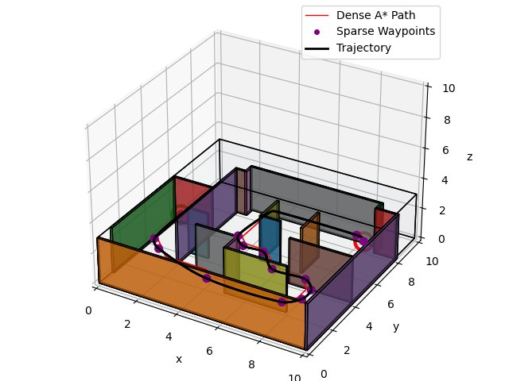
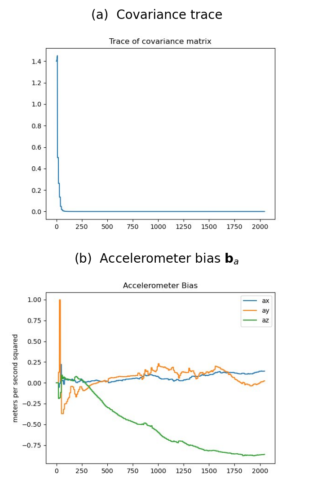
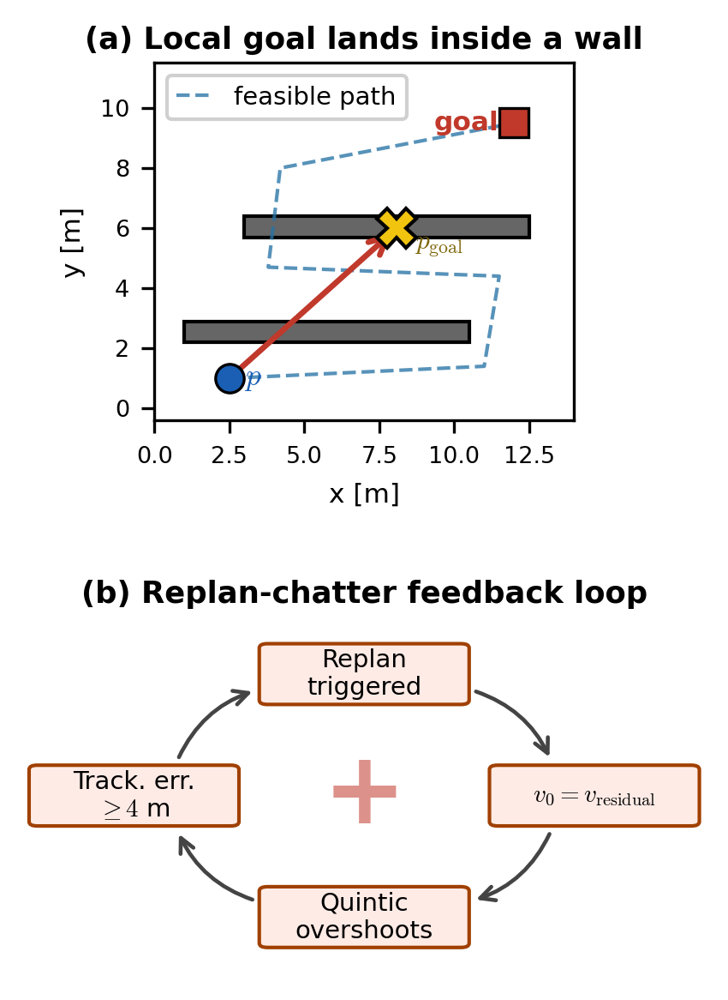

# Autonomous VIO-Based Quadcopter Navigation

A GPS-denied autonomous quadrotor system integrating visual-inertial odometry (VIO), motion planning, trajectory generation, SE(3) geometric control, and local replanning for collision-free navigation in obstacle-dense environments.

---

# Overview

This project implements a full closed-loop quadrotor autonomy stack operating without ground-truth state feedback or external positioning systems such as GPS.

The system combines:

* Visual-Inertial Odometry (VIO)
* 3D occupancy-grid motion planning
* Minimum-jerk trajectory generation
* SE(3) geometric tracking control
* Online local replanning
* Collision-aware autonomous navigation

Unlike traditional trajectory-tracking simulations that use perfect state information, this system feeds noisy onboard state estimates directly into the controller, coupling estimation uncertainty into the planning and control pipeline.

The project was developed in the `flightsim` simulation environment and evaluated across multiple cluttered benchmark maps.

---

# Demo

## Autonomous Flight Execution


This figure shows autonomous quadrotor navigation through an obstacle-dense environment.

* Black curve: generated trajectory
* Blue points: executed flight trajectory
* Colored blocks: obstacles and walls

The planned and executed trajectories remain visually aligned throughout the flight, demonstrating stable closed-loop autonomy using onboard VIO state estimation.

---

# System Architecture

```text
Stereo Features + IMU
          ↓
        VIO
          ↓
   State Estimation
          ↓
   Motion Planning
          ↓
 Trajectory Generation
          ↓
    SE(3) Controller
          ↓
 Quadrotor Dynamics
```

The autonomy stack replaces simulator-provided ground-truth states with ESKF-based onboard estimates, making the system significantly more sensitive to:

* estimator drift
* sensor noise
* aggressive trajectories
* actuator saturation
* replanning instability

---

# Core Components

## Visual-Inertial Odometry (VIO)

The estimator fuses stereo-feature observations and IMU measurements to estimate:

* quadrotor pose
* velocity
* accelerometer bias
* covariance uncertainty

Implemented components include:

* IMU propagation
* Stereo reprojection updates
* Error-State Kalman Filter (ESKF)
* Covariance propagation and correction
* Accelerometer-bias estimation

The VIO estimate directly replaces ground-truth simulator feedback inside the control loop.

---

## Motion Planning

The planner generates collision-free trajectories over 3D occupancy grids using graph-search-based planning.

Key functionality:

* Occupancy-grid inflation
* A* graph search
* Waypoint sparsification
* Minimum-jerk trajectory fitting
* Adaptive time allocation
* Collision-aware path validation

Trajectory smoothness and aggressiveness were tuned carefully to balance:

* tracking accuracy
* estimator robustness
* control stability
* flight speed

---

## SE(3) Geometric Control

The SE(3) controller tracks both:

* position
* orientation

while computing:

* desired thrust
* desired moments
* feasible rotor commands

The controller was modified specifically for noisy VIO feedback conditions.

Key modifications included:

* reduced position-loop gains
* velocity low-pass filtering
* conservative acceleration limiting
* actuator feasibility handling

These changes significantly improved robustness under estimator drift and noisy velocity estimates.

---

## Local Replanning

An additional replanning module enables autonomous navigation using limited local map information.

The replanning system:

* builds local occupancy maps
* computes cropped local goals
* replans trajectories online
* updates trajectories during flight
* mitigates replanning chatter and oscillations

The local replanner alternates between:

* executing mode
* replanning mode

using trigger-based online replanning logic.

---

# Motion Planning Pipeline



This visualization shows the trajectory-generation process:

* Red curve: dense A* graph-search path
* Purple points: sparse waypoint set
* Black curve: smooth minimum-jerk trajectory

The planner converts discrete graph-search outputs into dynamically feasible trajectories suitable for quadrotor flight.

---

# State Estimation Diagnostics



The estimator diagnostics visualize:

## Covariance Trace

The covariance trace collapses rapidly within the first ~50 filter updates, indicating successful estimator convergence and uncertainty reduction.

## Accelerometer Bias Estimation

The accelerometer bias estimate evolves over time as the filter compensates for IMU drift and measurement noise.

The z-axis bias drift observed during long flights directly motivated controller gain reductions and conservative acceleration limits.

---

# Failure Analysis and Replanning Challenges



This figure illustrates two major failure mechanisms encountered during local replanning.

## Local Goal Inside Obstacles

Straight-line local-goal cropping can place intermediate planning targets inside obstacles in folded switchback geometries.

As a result:

* A* receives infeasible local goals
* the planner loses corridor structure
* replanning quality degrades significantly

## Replanning Chatter Feedback Loop

Residual velocity inherited during replanning can create oscillatory feedback loops:

1. Replan triggered
2. Residual velocity retained
3. Quintic trajectory overshoots
4. Tracking error increases
5. Replanning triggered again

This positive-feedback loop produced divergent oscillations on the switchback map.

Mitigation strategies included:

* velocity clipping
* conservative replanning thresholds
* improved local-goal handling
* trajectory smoothing adjustments

---

# Performance Summary

## Main Autonomy Stack

* Final autograder score: **97/100**
* Collision-free flight across all six benchmark environments
* Stable trajectory tracking using onboard VIO estimates
* 500 Hz SE(3) control loop
* ~200 Hz ESKF update rate

### Benchmark Maps

* maze
* over_under
* window
* stairwell
* slalom
* switchback

---

## Local Replanning Extension

* Extra-credit replanning score: **25/30**
* Passed 5/6 benchmark maps under local-planning constraints
* Successfully replanned trajectories online using limited local occupancy maps

Representative performance ratios:

* maze: ~1.7× slower than full-map planner
* slalom: ~2.2× slower than full-map planner

The switchback failure was analyzed mechanistically rather than treated as a simple tuning issue.

---

# Engineering Tradeoffs

A major focus of the project was balancing:

* trajectory aggressiveness
* estimator reliability
* controller bandwidth
* actuator feasibility
* replanning responsiveness
* collision safety

Key observations:

* aggressive trajectories amplified ESKF noise
* high derivative gains produced motor-command chatter
* estimator drift coupled directly into thrust commands
* replanning with residual velocity destabilized folded trajectories

The final tuning configuration prioritized total system robustness rather than isolated per-map optimality.

---

# Repository Structure

```text
vio-quadcopter-autonomy/
│
├── core_autonomy/
│   ├── estimation/
│   ├── planning/
│   ├── control/
│   └── trajectories/
│
├── local_replanning/
│
├── flightsim/
├── maps/
├── figures/
├── videos/
│
├── README.md
├── requirements.txt
└── LICENSE
```

---

# Technologies Used

* Python
* NumPy
* SciPy
* Matplotlib
* Visual-Inertial Odometry (VIO)
* Error-State Kalman Filter (ESKF)
* A* Motion Planning
* Minimum-Jerk Trajectory Generation
* SE(3) Geometric Control
* Occupancy Grid Mapping
* Quadrotor Dynamics
* Robotics Simulation

---

# Future Improvements

Potential future extensions include:

* onboard real-time deployment
* dynamic obstacle avoidance
* dense mapping and SLAM
* MPC-based trajectory tracking
* sampling-based planners (RRT*/BIT*)
* homotopy-aware replanning
* multi-agent quadrotor coordination

---

# Key Insights

* Closed-loop autonomy performance is highly sensitive to estimator noise.
* Controller gains that work under ground-truth feedback may become unstable under VIO-based state estimation.
* Local replanning heuristics must respect obstacle homotopy structure.
* Residual velocity during replanning can create oscillatory feedback loops in folded environments.
* Robust autonomy requires balancing estimation, planning, and control simultaneously rather than optimizing each subsystem independently.

---

# Acknowledgments

Developed as part of MEAM 620 at the University of Pennsylvania.

The project builds upon concepts from:

* Visual-Inertial Navigation
* Quadrotor Control
* Motion Planning
* Autonomous Robotics
* GPS-denied flight systems

